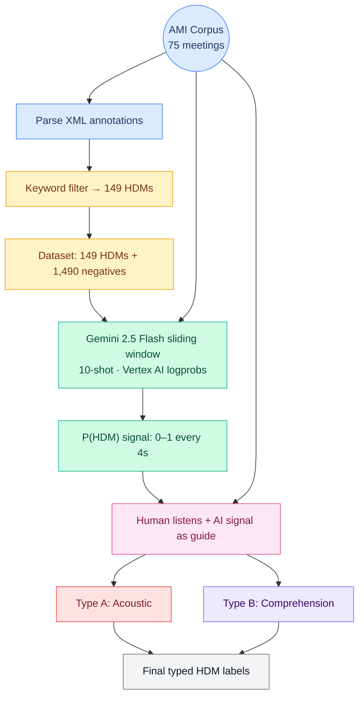

# Detecting Hearing Difficulty Moments in Meeting Audio

A replication and extension of [Collins et al. (2025)](https://arxiv.org/abs/2507.23590) — using Gemini 2.5 Flash on Vertex AI to automatically detect moments when listeners struggle to understand what was said in the [AMI Meeting Corpus](https://groups.inf.ed.ac.uk/ami/corpus/).

---

## Background

**Hearing Difficulty Moments (HDMs)** are brief moments in conversation when a listener fails to understand what was said — signaled by responses like *"What?"*, *"Huh?"*, *"Sorry?"*, or *"Which was that?"*. Collins et al. (2025) demonstrated that large language models can detect these moments from audio alone, achieving F1 = 0.87 with Gemini 1.5 Pro using 10-shot prompting.

We distinguish two types of HDM:

- **Type A — Acoustic:** The listener physically misheard the audio (unclear speech, background noise, overlapping speakers)
- **Type B — Comprehension:** The listener heard the words but lacked the language or comprehension to understand (unfamiliar jargon, accented speech, complex phrasing)

This project replicates the Collins et al. approach on the full AMI Meeting Corpus and extends it with:

- A **sliding window classifier** that produces a continuous P(HDM) probability signal across entire meetings (not just per-segment classification)
- A **human labeling pipeline** where annotators listen to full meeting audio and place typed HDM markers (A or B), replacing the prior AI-only labels
- An **interactive waveform dashboard** with audio playback, recreating the paper's Figure 1 visualization
- **Signal quality metrics** for evaluating detection accuracy per meeting

---

## Pipeline Overview

| Color | Stage |
|-------|-------|
| 🔵 Blue | Data ingestion — AMI corpus audio and annotations |
| 🟡 Yellow | Filtering — keyword extraction and dataset construction |
| 🟢 Green | AI classification — Gemini sliding window on Vertex AI |
| 🩷 Pink | Human labeling — annotator review with AI signal as guide |
| 🔴 Red / 🟣 Purple | HDM types — Type A (acoustic) / Type B (comprehension) |
| ⚪ Gray | Output — final human-verified, typed labels |



---

## The Data

The [AMI Meeting Corpus](https://groups.inf.ed.ac.uk/ami/corpus/) is a well-known dataset of 100 hours of recorded meetings. In the scenario portion, teams of 4 people role-play designing a TV remote control across multiple sessions. Participants include a Project Manager, Marketing Expert, User Interface Designer, and Industrial Designer.

Each meeting ID encodes its metadata — `ES2002b` means **E**dinburgh site, **S**cenario, group **2002**, session **b** (functional design). Recordings come from three sites (Edinburgh, Idiap in Switzerland, TNO in the Netherlands) with different room acoustics. Most participants are non-native English speakers, which is relevant since accented speech may affect both HDM frequency and model detection.

**HDM extraction:** The AMI corpus includes dialogue act annotations with a `COMMENT-ABOUT-UNDERSTANDING` tag. We parsed the XML annotations and applied a three-tier keyword filter to identify **149 confirmed HDMs** across **75 meetings**. These range from simple *"Sorry?"* to more complex *"Which was that?"*. Each HDM is paired with 10x negative samples (non-HDM segments) for a total of **1,639 segments**.

| | Count |
|---|---|
| Meetings with HDMs | 75 |
| Positive segments (HDMs) | 149 |
| Negative segments | 1,490 |
| Total segments | 1,639 |

Sessions follow four design phases:

| Session | Phase | Avg Duration |
|---------|-------|-------------|
| a | Kick-off — team intros, task overview | ~20 min |
| b | Functional design — requirements, specs | ~37 min |
| c | Conceptual design — components, UI concepts | ~38 min |
| d | Detailed design — final evaluation | ~35 min |

---

## What Has Been Done

### 1. Sliding Window Classifier

The core contribution. Gemini 2.5 Flash processes each meeting as a series of overlapping 12-second audio windows (4s context + 4s target + 4s after) at 4-second intervals. For each window, the model outputs a single "P" (positive) or "N" (negative) token. We extract the logprob for each token and compute:

```
P(HDM) = softmax(logprob_P, logprob_N)
```

This produces a continuous 0-1 probability signal across the entire meeting — not just a binary label per segment. Vertex AI is required because the standard Gemini API does not support token-level logprobs.

**Results completed:**
- 10-shot (5P + 5N examples): all 75 meetings
- Zero-shot: all 75 meetings
- Gemini 3.1 Pro backup: all 75 meetings

### 2. Baseline Methods

- **ASR Hotword Heuristic** — keyword matching on common HDM phrases
- **Random Baselines** — 50/50 coin flip and base-rate classifiers

### 3. Signal Quality Evaluation

Per-meeting scoring (0-100) combining detection accuracy and specificity:

| Metric | Mean |
|--------|------|
| Alignment Score | 74.3 |
| Peak probability near HDMs | 0.82 |
| Noise floor (non-HDM regions) | 0.17 |
| False alarm rate | 10.2% |
| Signal-to-noise ratio | 7.5 |

88% of meetings have their HDMs detected (peak P(HDM) > 0.5).

### 4. Interactive Dashboard

A waveform dashboard (`waveform_dashboard.py`, port 8766) recreating Collins et al. Figure 1 with full audio playback:

- Blue waveform with green P(HDM) probability overlay
- Red bands marking ground-truth HDM events
- Click-to-seek audio playback with keyboard shortcuts
- Per-HDM clip playback for individual events
- Sort and filter by alignment score, recording site, session phase, or participant group

### 5. Human Labeling Pipeline

The initial 10-shot examples used AI-generated labels. To ground the dataset in human judgment, we built a dedicated labeling pipeline (`human_labeling_pipeline.py`, port 8770) where annotators:

1. Listen to full meeting audio with waveform + AI probability signal visible for reference
2. Click the waveform at any timestamp where they hear an HDM
3. Classify each as **Type A** (acoustic — misheard) or **Type B** (comprehension — heard but didn't understand)
4. Optionally add notes (e.g. "overlapping speakers", "strong accent")

Multiple labelers are supported via `--labeler` flag, enabling inter-annotator agreement analysis. Labels are saved per-labeler per-meeting to `data/human_hdm_labels.json`.

### 6. Validation

- **Data leakage audit** — 8-point check confirming no train/test contamination across 5-fold Monte Carlo cross-validation (see `VALIDATION.md`)
- **Prediction browser** — manual inspection of every classification with audio

---

## Quick Start

### Prerequisites

- Python 3.12+
- Google Cloud account with Vertex AI API enabled
- AMI Meeting Corpus audio (16kHz mono WAV)

### Install

```bash
python -m venv .venv && source .venv/bin/activate
pip install google-genai numpy soundfile tqdm python-dotenv scikit-learn plotly torch transformers
```

### Authenticate with Vertex AI

Vertex AI is required for logprobs — the standard Gemini API doesn't support them.

```bash
gcloud auth application-default login --project <YOUR_PROJECT_ID>
```

### Run

```bash
# Run the sliding window classifier (all meetings, 10-shot)
python src/gemini_sliding_window.py

# Single meeting
python src/gemini_sliding_window.py --meeting ES2003b

# Zero-shot mode
python src/gemini_sliding_window.py --shots 0

# Launch the interactive dashboard
python src/waveform_dashboard.py
# Open http://localhost:8766

# Evaluate signal quality
python src/evaluate_signal.py --plot

# Launch the human labeling pipeline
python src/human_labeling_pipeline.py --labeler alice
# Open http://localhost:8770
```

---

## Project Structure

```
src/
  gemini_sliding_window.py     # Main classifier — Gemini 2.5 Flash sliding window
  waveform_dashboard.py        # Interactive dashboard with audio (port 8766)
  evaluate_signal.py           # Signal quality scoring and plots
  build_dataset.py             # Dataset construction from AMI annotations
  filter_hdm.py                # HDM annotation filtering (3-tier keyword filter)
  parse_ami_annotations.py     # AMI XML annotation parser
  download_audio.py            # AMI audio downloader
  baseline_hotword.py          # ASR hotword baseline
  random_baseline.py           # Random baselines
  gemini_audio_classifier.py   # Gemini per-segment baseline classifier
  figure1_dashboard.py         # Static Figure 1 (Plotly HTML)
  validation_dashboard.py      # Prediction browser with audio
  validation_audit.py          # Data leakage audit
  labeling_tool.py             # AI-label verification tool (Yes/No per HDM)
  human_labeling_pipeline.py   # Human labeling pipeline — Type A/B markers (port 8770)

results/
  sliding_window_10shot/       # 10-shot P(HDM) results (75 meetings)
  sliding_window/              # Zero-shot P(HDM) results (75 meetings)
  sliding_window_gemini31pro_backup/  # Gemini 3.1 Pro backup (75 meetings)
  signal_evaluation.html       # Signal quality plots
  baseline_hotword.json        # Hotword baseline results
  random_baseline.json         # Random baseline results

data/
  hdm_annotations.json         # All parsed HDM annotations (2,560 entries)
  hdm_filtered.json            # Filtered HDM set (149 positives)
  hdm_labels.json              # AI-label verification (yes/no)
  human_hdm_labels.json        # Human pipeline labels (Type A/B, per labeler)
  audio/                       # AMI WAV files (not tracked)
  dataset/                     # Built dataset + segments (not tracked)
```

---

## Reference

Collins, J., Banos, A., Culley, C., Ballesta Rosen, A., Machum, J., Lyon, R. F., & Carlile, S. (2025). *Identifying Hearing Difficulty Moments in Conversational Audio*. arXiv:2507.23590.
